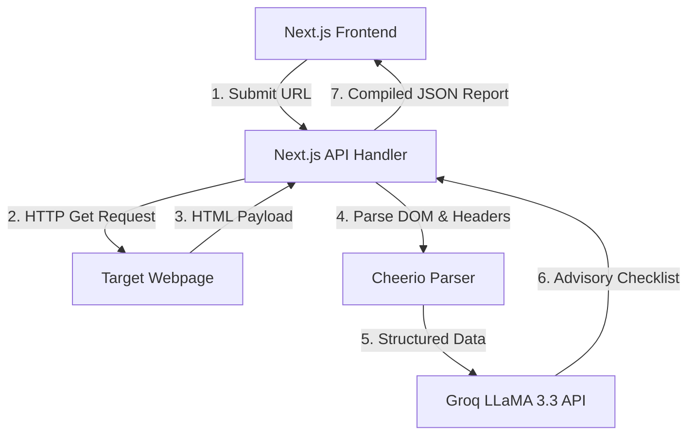

<div align="center">
  <br />
  
  <br />
  <h1>📡 SEOBEACON</h1>
  <p><strong>Grade your website's search value, instantaneously.</strong></p>
  <p><i>A Premium, High-Performance Website SEO Auditor, Social Card Debugger, and AI-Powered Backlink Checklist Generator.</i></p>

  <br />

  <div align="center">
    <a href="https://nextjs.org/"></a>
    <a href="https://react.dev/"></a>
    <a href="https://tailwindcss.com/"></a>
    <a href="https://groq.com/"></a>
    <a href="https://cheerio.js.org/"></a>
    <a href="https://discord.com/invite/ZVCB8EnRX2"></a>
  </div>

  <br />
  <div align="center">
    <a href="https://payments.cashfree.com/forms/shrey" target="_blank">
      
    </a>
  </div>
  <br />

  <p align="center">
    <a href="#about-seobeacon">About</a> |
    <a href="#key-features">Key Features</a> |
    <a href="#system-architecture">Architecture</a> |
    <a href="#tech-stack">Tech Stack</a> |
    <a href="#setup--self-hosting">Setup</a> |
    <a href="#license">License</a>
  </p>
</div>

---

## About SeoBeacon

**SeoBeacon** is a comprehensive, open-source web audit dashboard engineered to diagnose and grade any public webpage's technical SEO parameters. Combining the speed of a raw HTML crawler with the intelligence of LLMs, it parses meta assets, outline hierarchies, and link distributions before feeding the context into Groq's LLaMA 3.3 model to generate highly actionable organic optimization blueprints.

<div align="center">
  <table border="0" cellspacing="0" cellpadding="20">
    <tr>
      <td width="300" valign="top" style="border: 1px solid #333; border-radius: 15px; background: rgba(255,255,255,0.05);">
        <h3>🔍 Dynamic Audits</h3>
        <p>Parses canonical status, Alt attributes, OpenGraph structures, and crawling commands instantly with <b>Cheerio</b>.</p>
      </td>
      <td width="300" valign="top" style="border: 1px solid #333; border-radius: 15px; background: rgba(255,255,255,0.05);">
        <h3>🧠 AI Action Plans</h3>
        <p>Generates contextual SEO checklists and organic backlink-building blueprints using <b>Groq LLaMA 3.3 (70B)</b>.</p>
      </td>
    </tr>
    <tr>
      <td width="300" valign="top" style="border: 1px solid #333; border-radius: 15px; background: rgba(255,255,255,0.05);">
        <h3>⚡ Ultra-Low Latency</h3>
        <p>Built on Next.js 16 with optimized server handlers and client-side memory caching to minimize redundant scans.</p>
      </td>
      <td width="300" valign="top" style="border: 1px solid #333; border-radius: 15px; background: rgba(255,255,255,0.05);">
        <h3>🎨 Modern Aesthetics</h3>
        <p>A dark-mode first, glassmorphic client interface built with <b>Tailwind 4.0</b>, <b>Framer Motion</b>, and <b>Lenis Smooth Scroll</b>.</p>
      </td>
    </tr>
  </table>
</div>

---

## Key Features

*   **Meta Assets Validator**: Analyzes title tags, descriptions, canonical status, and robots instructions.
*   **Hierarchical Heading Outline**: Audits semantic layout flow (H1 $\rightarrow$ H2 $\rightarrow$ H3) for crawl readability.
*   **OpenGraph & Twitter Card Snippets**: Simulates live Facebook and Twitter link-preview cards in real-time.
*   **Accessibility Scanner**: Audits alt attributes on images and exposes text-to-HTML markup densities.
*   **Server Diagnostics**: Measures response latency, page size, SSL certificate validity, and Gzip compression.
*   **Link Auditor**: Inspects internal vs external ratios, flags broken/empty anchors, and parses nofollow attributes.
*   **AI Recommendations Engine**: Leverages Groq LLMs to write site-specific backlink checklists and code recommendations.

---

## System Architecture

SeoBeacon queries the target web page directly from the Next.js API route, extracts semantic tags using Cheerio, runs local evaluation algorithms, and then prompts Groq LLaMA 3.3 for structured advisory notes before feeding the final report to the interactive frontend dashboard.



---

## Tech Stack

*   **Framework**: Next.js 16 (App Router), React 19, TypeScript
*   **Styling**: Tailwind CSS v4, Framer Motion (micro-animations), Phosphor Icons
*   **Scraper Engine**: Cheerio HTML parser
*   **Intelligence**: Groq SDK (LLaMA 3.3 70B model)
*   **Smooth Scroll**: Lenis Scroll

---

## Setup & Self-Hosting

### Prerequisites

*   Node.js (v18 or higher)
*   npm / pnpm / yarn
*   A **Groq API Key** (obtainable from the [Groq Console](https://console.groq.com/))

### Installation

1. **Clone the Repository**
   ```bash
   git clone https://github.com/lazyshrey/seo-beacon.git
   cd seo-beacon
   ```

2. **Install Dependencies**
   ```bash
   npm install
   ```

3. **Configure Environment Variables**
   Create a `.env.local` file in the root directory:
   ```env
   GROQ_API_KEY=your_groq_api_key_here
   ```

4. **Launch Development Server**
   ```bash
   npm run dev
   ```
   Open [http://localhost:3000](http://localhost:3000) to access the application.

---

## License

This project is licensed under the MIT License - see the [LICENSE](LICENSE) file for details.
